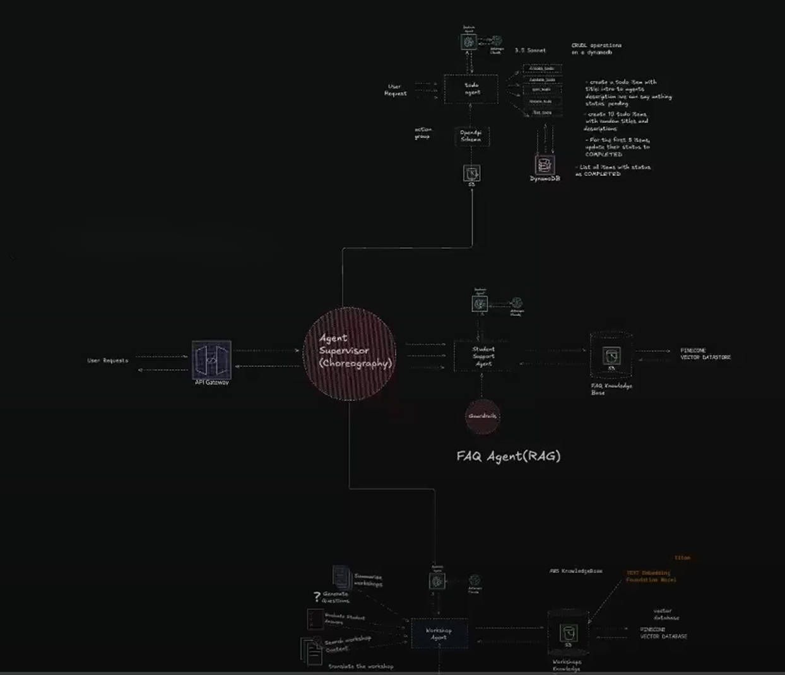

# SymphonyAgents

An intelligent multi-agent orchestration system that harmonizes AI agents to work together seamlessly, creating a symphony of automated intelligence.

## Overview

SymphonyAgents is a powerful framework for building and orchestrating multiple AI agents that collaborate to solve complex tasks. Like a conductor leading an orchestra, SymphonyAgents coordinates specialized agents, each with unique capabilities, to achieve sophisticated goals through intelligent collaboration.

## Features

- **Multi-Agent Orchestration**: Coordinate multiple specialized agents working in harmony
- **Intelligent Task Distribution**: Automatically route tasks to the most capable agents
- **Collaborative Problem Solving**: Agents work together, sharing context and insights
- **Modular Architecture**: Easily add, remove, or customize agents for your needs
- **Scalable Design**: Handle complex workflows with multiple concurrent agents
- **Real-time Coordination**: Agents communicate and synchronize in real-time

## Architecture



The SymphonyAgents architecture consists of:

- **Conductor Agent**: Orchestrates and coordinates all other agents
- **Specialized Agents**: Task-specific agents with unique capabilities
- **Message Bus**: Enables inter-agent communication
- **State Manager**: Maintains shared context across agents
- **Task Queue**: Manages and prioritizes agent tasks

## Getting Started

### Prerequisites

- Python 3.8+
- pip or conda for package management

### Installation

```bash
# Clone the repository
git clone https://github.com/smaliaquib/SymphonyAgents.git
cd SymphonyAgents

# Install dependencies
pip install -r requirements.txt
```

## Agent Types

SymphonyAgents supports various agent types:

- **FAQ Agents**: Gather and analyze information
- **Content Agents**: Create and edit content
- **Supervisor Agents**: Generate and review code
- **TODO Agents**: Process and interpret data

### Key Concepts

- **Agent Communication**: How agents share information
- **Task Routing**: Intelligent task distribution strategies
- **State Management**: Maintaining context across agents
- **Custom Agents**: Building your own specialized agents

## Contributing

Contributions are welcome! Please feel free to submit a Pull Request.

1. Fork the repository
2. Create your feature branch (`git checkout -b feature/AmazingFeature`)
3. Commit your changes (`git commit -m 'Add some AmazingFeature'`)
4. Push to the branch (`git push origin feature/AmazingFeature`)
5. Open a Pull Request

## Acknowledgments

- Inspired by multi-agent systems and orchestration patterns
- Built with the power of modern AI and LLMs
- Thanks to all contributors and the open-source community


## Roadmap

- [ ] Add support for more LLM providers
- [ ] Implement visual agent monitoring dashboard
- [ ] Add agent performance metrics and analytics
- [ ] Create pre-built agent templates
- [ ] Develop agent marketplace for sharing custom agents
- [ ] Support for distributed agent execution

---
